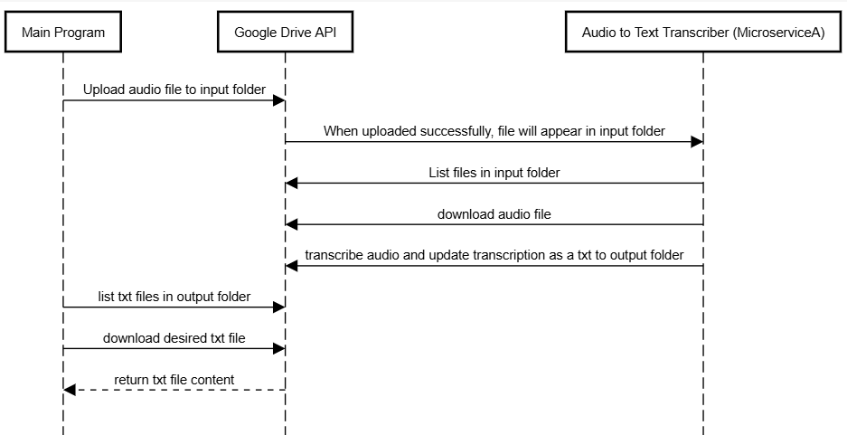

# Communication Contract for the Audio to Text Transcriber

# The microservice accepts audio files that are uploaded to my OSU Google Drive folder (MicroserviceA) and returns a transcription of the speech via txt files. There are 2 folders in the MicroserviceA folder, one that holds the uploaded audio files and another that holds the transcribed audio files.


# How To REQUEST Data:
# Use Google Drive API and import the required Google API libaries into your code
# Load your OAuth credentials and initialize the Google Drive API client
# Create metadata for the file you want to upload, include my input folder ID
# Upload the file

# Example Call:
```metadata = {
    'file_name': 'name.mp3',
    'parents': ['1A1FBA_2GNzbRKX0mkGPHmyDGiKsXrBqh']
}
media = MediaFileUpload('name.mp3', mimetype='audio/mpeg')

drive_service.files().create(body=metadata, media_body=media).execute()
```

# How to RECEIVE Data:
# Import the required Google API libaries as needed
# To receive your transcribed audio files, you can list and download
# the txt files from my output folder, using the output folder ID.

# Example Call:
```list_files = drive_service.files().list(
    q="'1EZtGucwrRtTEnUt9tMByD7nAQ7wTSYfq' in parents and mimeType='text/plain'",
    fields="files(id, name)"
).execute()

files = list_files.get('files', [])
for file in files:
    request = drive_service.files().get_media(fileId=file['id'])
    with open(file['name'], 'wb') as f:
        downloader = MediaIoBaseDownload(f, request)
        done = False
        while not done:
            done = downloader.next_chunk()
```


